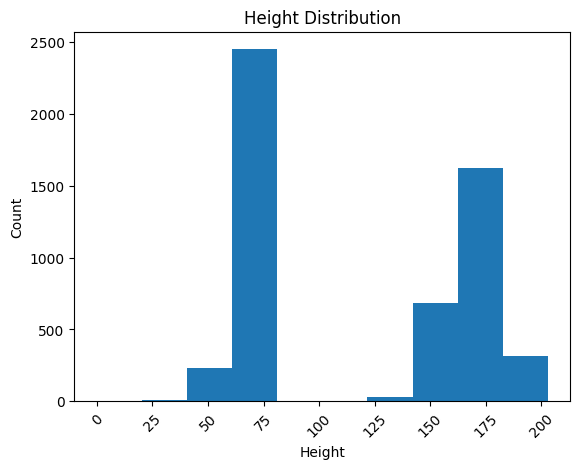
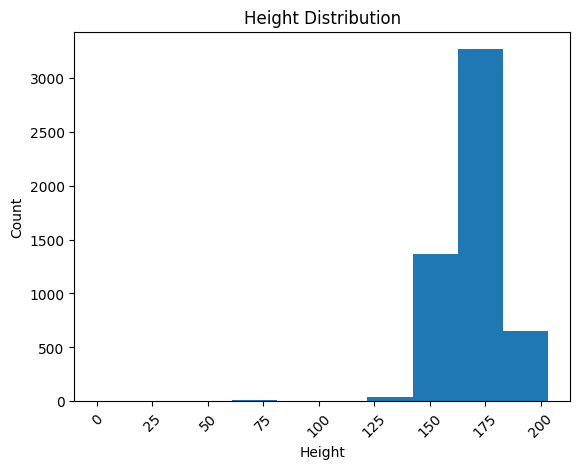

##########
Case Study
##########

Extraction and preparation of Sepsis data for Machine Learning applications.

*******
Outline
*******

#. Introduction
#. Set-up
#. Cohort Selection
#. Data Standardisation
#. Data Preperation
#. Data Pre-processing
#. Data Preparation
#. Conclusion

1. Introduction
===============

In this case study, our main objective is to showcase the effectiveness of EHR-QC. We achieve this by employing the toolkit to handle EHR data comprehensively, preparing it for utilization in Machine Learning applications. To illustrate, we select a group of patients who have been diagnosed with Sepsis from the public MIMIC IV EHR database. Subsequently, we employ the EHR-QC standardization module to standardise the EHR records for these patients, converting them into the OMOP-CDM schema. Following this, we employ the EHR-QC data pre-processing module. This involves extracting information from the standardized schema, generating exploratory reports, and identifying as well as rectifying any anomalies present in the data.

2. Set-up
=========

In this case study, we utilizeed the Dockerized EHR-QC. For comprehensive instructions on configuring the Docker environment, please consult the documentation provided at the following link: https://ehr-qc-tutorials.readthedocs.io/en/latest/install.html#docker

3. Cohort selection
===================

From the MIMIC IV dataset, we've identified all patients and admissions related to Sepsis. This selection involves utilizing ICD-9 codes ``995.91``, ``995.92``, and ``785.52``, as well as ICD-10 codes ``A419``, ``R6520``, and ``R6521`` which pertain to Sepsis, Severe Sepsis, and Septic Shock. Subsequently, we've extracted the complete electronic health record (EHR) data associated with these patients and admissions, converting them into csv files.

This process yielded a total of ``12,276`` patients corresponding to ``14,870`` admissions, along with their respective EHR data.

4. Data standardisation
=======================

In the subsequent phase, the EHR data associated with the Sepsis cohort, as contained in the CSV files, is standardized by being structured according to the OMOP-CDM schema. This task is accomplished through the utilization of the EHR-QC utility, which carries out a series of sequential steps, culminating standard EHR representation. The information required by the code to source the data from the relational database (RDBMS), store the intermediate data, and dump the standardised EHR are provided in the configuration file as shown below before executing the utility functions. For more details on configuration options, refer the documentation: https://ehr-qc-tutorials.readthedocs.io/en/latest/config.html

.. code-block:: python

    # database connection details
    db_details = {
        "sql_host_name": <Host Name>,
        "sql_port_number": <Port Number>,
        "sql_user_name": <User Name>,
        "sql_password": ******,
        "sql_db_name": <DB Name>,
    }

    # new schema to host the migrated tables

    lookup_schema_name = 'vocabulary_test_20230809'

    source_schema_name = 'omop_migration_source_20230809'

    etl_schema_name = 'omop_migration_etl_20230809'

    cdm_schema_name = 'omop_test_20230809'

Running the standardisation involves the following stages:

#. Incorporating the Standard Vocabulary (Athena)

If running via command line:

.. code-block:: console

    (.venv) app_user@hostname:~$python -m ehrqc.standardise.migrate_omop.Run -l

If using Jupyter notebook:

.. code-block:: python

    import os

    os.system(
        '''cd /path/to/EHRQC;'''
        +
        '''.venv/bin/python -m ehrqc.standardise.migrate_omop.Run -l'''
        )

The paths of the files containing controlled vocabulary concepts are obtained from configuration file as shown below. For more details on configuration options, refer the documentation: https://ehr-qc-tutorials.readthedocs.io/en/latest/config.html

.. code-block:: python

    vocabulary = {
        'concept': '/path/to/CONCEPT.csv',
        'vocabulary': '/path/to/VOCABULARY.csv',
        'domain': '/path/to/DOMAIN.csv',
        'concept_class': '/path/to/CONCEPT_CLASS.csv',
        'concept_relationship': '/path/to/CONCEPT_RELATIONSHIP.csv',
        'relationship': '/path/to/RELATIONSHIP.csv',
        'concept_synonym': '/path/to/CONCEPT_SYNONYM.csv',
        'concept_ancestor': '/path/to/CONCEPT_ANCESTOR.csv',
        'tmp_custom_mapping': '/path/to/tmp_custom_mapping.csv',
    }

#. Importing EHR data from the CSV files

If running via command line:

.. code-block:: console

    (.venv) app_user@hostname:~$python -m ehrqc.standardise.migrate_omop.Run -f

If using Jupyter notebook:

.. code-block:: python

    import os

    os.system(
        '''cd /path/to/EHRQC;'''
        +
        '''.venv/bin/python -m ehrqc.standardise.migrate_omop.Run -f'''
        )

The paths and the column mapping (if other than the expected names) needs to configured in the configuration file as shown below before running this command. For more details on configuration options, refer the documentation: https://ehr-qc-tutorials.readthedocs.io/en/latest/config.html 

.. code-block:: python

    # CSV file column mapping
    
    patients = {
        'file_name': '/path/to/patients.csv',
        'column_mapping': {
            'subject_id': 'non_standard_subject_id',
            'gender': 'non_standard_gender',
            'anchor_age': 'non_standard_anchor_age',
            'anchor_year': 'non_standard_anchor_year',
            'anchor_year_group': 'non_standard_anchor_year_group',
            'dod': 'non_standard_dod'
        },
    }

#. Staging the data within staging tables

If running via command line:

.. code-block:: console

    (.venv) app_user@hostname:~$python -m ehrqc.standardise.migrate_omop.Run -s

If using Jupyter notebook:

.. code-block:: python

    import os

    os.system(
        '''cd /path/to/EHRQC;'''
        +
        '''.venv/bin/python -m ehrqc.standardise.migrate_omop.Run -s'''
        )

#. Integrating custom concept mappings for concepts that deviate from the standard

If running via command line:

.. code-block:: console

    (.venv) app_user@hostname:~$python -m ehrqc.standardise.migrate_omop.Run -c

If using Jupyter notebook:

.. code-block:: python

    import os

    os.system(
        '''cd /path/to/EHRQC;'''
        +
        '''.venv/bin/python -m ehrqc.standardise.migrate_omop.Run -c'''
        )

#. Executing the migration process

If running via command line:

.. code-block:: console

    (.venv) app_user@hostname:~$python -m ehrqc.standardise.migrate_omop.Run -e

If using Jupyter notebook:

.. code-block:: python

    import os

    os.system(
        '''cd /path/to/EHRQC;'''
        +
        '''.venv/bin/python -m ehrqc.standardise.migrate_omop.Run -e'''
        )

#. Transitioning to the OMOP-CDM schema

If running via command line:

.. code-block:: console

    (.venv) app_user@hostname:~$python -m ehrqc.standardise.migrate_omop.Run -u

If using Jupyter notebook:

.. code-block:: python

    import os

    os.system(
        '''cd /path/to/EHRQC;'''
        +
        '''.venv/bin/python -m ehrqc.standardise.migrate_omop.Run -u'''
        )

For more comprehensive insights into each of these stages, please consult the following link: https://ehr-qc-tutorials.readthedocs.io/en/latest/migrate.html#omop-cdm-migration.

This culminated in the successful migration of the entire cohort (100 %), encompassing all the ``12,276`` patients and ``14,870`` admissions, alongside their respective EHR data in a fully automated manner.

Utilizing well-established, compatible tools and techniques becomes notably more straightforward when working with data that has been transformed into a standardized format.

5. Data Extraction
==================

During this stage, we retrieve the demographics, vital signs, and lab measurements of the Sepsis cohort from the standardized OMOP-CDM schema using EHR-QC pre-processing module.

Successful extraction using the following commands yielded;

If running via command line:

.. code-block:: console

    (.venv) app_user@hostname:~$python -m ehrqc.extract.Extract /save/path/demographics.csv omop demographics omop_test_20230809

If using Jupyter notebook:

.. code-block:: python

    import os

    os.system(
        '''cd /path/to/EHRQC;'''
        +
        '''.venv/bin/python -m ehrqc.extract.Extract /save/path/demographics.csv omop demographics omop_test_20230809'''
        )

#. Demographics data for ``12,276`` patients, encompassing 7 attributes: ``Age``, ``Weight``, ``Height``, ``Gender``, ``Ethnicity``, ``Date of Birth``, and ``Date of Death`` (if applicable)

If running via command line:

.. code-block:: console

    (.venv) app_user@hostname:~$python -m ehrqc.extract.Extract /save/path/vitals.csv omop vitals omop_test_20230809

If using Jupyter notebook:

.. code-block:: python

    import os

    os.system(
        '''cd /path/to/EHRQC;'''
        +
        '''.venv/bin/python -m ehrqc.extract.Extract /save/path/vitals.csv omop vitals omop_test_20230809'''
        )

#. Vital signs data for ``8,436`` patients, comprising 10 attributes: ``Heart rate``, ``Systolic Blood Pressure``, ``Diastolic Blood Pressure``, ``Mean Blood Pressure``, ``Respiratory rate``, ``Body Temperature``, ``Oxygen Saturation (SpO2)``, ``Glasgow Coma Scale (GCS) Eye score``, ``GCS Verbal score``, and ``GCS Motor score``

If running via command line:

.. code-block:: console

    (.venv) app_user@hostname:~$python -m ehrqc.extract.Extract /save/path/lab_measurements.csv omop lab_measurements omop_test_20230809

If using Jupyter notebook:

.. code-block:: python

    import os

    os.system(
        '''cd /path/to/EHRQC;'''
        +
        '''.venv/bin/python -m ehrqc.extract.Extract /save/path/lab_measurements.csv omop lab_measurements omop_test_20230809'''
        )

#. Lab measurements for ``12,169`` patients, involving 29 attributes: ``Lactate``, ``Blood Carbon Dioxide``, ``Albumin``, ``Urine Glucose``, ``Band Form Neutrophils``, ``Blood Base Excess``, ``Blood Potassium``, ``Blood pH``, ``Serum Chloride``, ``Serum Carbon Dioxide``, ``Bilirubin``, ``Blood Auto Leukocytes``, ``Creatinine``, ``INR (International Normalized Ratio)``, ``Serum Sodium``, ``Blood Sodium``, ``Hemoglobin``, ``Body Fluid pH``, ``Platelet Count``, ``Urea Nitrogen``, ``Serum Glucose``, ``Blood Chloride``, ``Oxygen``, ``Bicarbonate``, ``Serum Potassium``, ``Anion Gap``, ``Manual Blood Leukocytes``, ``Hematocrit``, and ``aPTT (Activated Partial Thromboplastin Time)``

It's worth noting that some patients lack recorded values for the listed vital signs or lab measurements attributes. Consequently, these patients are excluded from the extracted files, resulting in a reduction in the total number of rows after this stage. Specifically, our efforts yield complete demographic data for the entire Sepsis cohort of ``12,276`` patients, while lab measurements are available for ``12,169`` patients, and vital signs data is present for approximately ``8,436`` patients only.

To understand the extraction capabilities offered by the EHR-QC, kindly consult the documentation provided at: https://ehr-qc-tutorials.readthedocs.io/en/latest/process.html#extract

6. Data Pre-processing
======================

Next, the exploration and anomaly reports are generated from the extracted data using EHR-QC pre-processing module. It will also highlight the presence of anomalous data, and provide specific pointers to correct them. Furthermore, it has the capability to automatically impute the missing values and remove the outliers.

More details on the EHR-QCs pre-processing utility can be found here: https://ehr-qc-tutorials.readthedocs.io/en/latest/process.html#pre-processing

The specific commands used to generate the exploration and anomaly reports are provided below;

Exploration Reports
-------------------

Data exploration reports generate overall summary of all the attributes present in the data (Figure 1), visualisations showing the data missingness (Figure 9 and Figure 10), and distribution of the individual attributes (Figure 2) that are useful to get an overview of the EHR.

Figure 1: A sample summary table from the EHR-QC exploration report

Figure 2: A sample violin plot showing probability density distribution and the summary statistics obtained from the EHR-QC exploration report giving a detailed description of the attribute

Demographics
^^^^^^^^^^^^

If running via command line:

.. code-block:: console

    (.venv) app_user@hostname:~$python -m ehrqc.qc.Plot demographics_explore /save/path/demographics.csv /save/path/demographics_explore.html

If using Jupyter notebook:

.. code-block:: python

    import os

    os.system(
        '''cd /path/to/EHRQC;'''
        +
        '''.venv/bin/python -m ehrqc.qc.Plot demographics_explore /save/path/demographics.csv /save/path/demographics_explore.html'''
        )

Vitals
^^^^^^

If running via command line:

.. code-block:: console

    (.venv) app_user@hostname:~$python -m ehrqc.qc.Plot vitals_explore /save/path/vitals.csv /save/path/vitals_explore.html

If using Jupyter notebook:

.. code-block:: python

    import os

    os.system(
        '''cd /path/to/EHRQC;'''
        +
        '''.venv/bin/python -m ehrqc.qc.Plot vitals_explore /save/path/vitals.csv /save/path/vitals_explore.html'''
        )

Lab Measurements
^^^^^^^^^^^^^^^^

If running via command line:

.. code-block:: console

    (.venv) app_user@hostname:~$python -m ehrqc.qc.Plot lab_measurements_explore /save/path/lab_measurements_corrected.csv /save/path/lab_measurements_explore.html

If using Jupyter notebook:

.. code-block:: python

    import os

    os.system(
        '''cd /path/to/EHRQC;'''
        +
        '''.venv/bin/python -m ehrqc.qc.Plot lab_measurements_explore /save/path/lab_measurements_corrected.csv /save/path/lab_measurements_explore.html'''
        )

Anomaly Reports
---------------

In addition to the all attributes summary and missing values plot that provide data overview, anomaly reports contain detail outcomes on missing analysis (Figure 3), outlier analysis (Figure 4), error analysis (Figure 5), and inconsistancies analysis (Figure 6).

Figure 3: A sample missing data analysis table from the EHR-QC anomaly report

Figure 4: A sample outlier analysis table from the EHR-QC anomaly report

Figure 5: A sample error analysis table from the EHR-QC anomaly report

Figure 6: A sample inconsistancies analysis table from the EHR-QC anomaly report

Vitals
^^^^^^

If running via command line:

.. code-block:: console

    (.venv) app_user@hostname:~$python -m ehrqc.qc.Anomalies /save/path/vitals_corrected.csv /save/path/ after_vitals  -dm -do -de -di

If using Jupyter notebook:

.. code-block:: python

    import os

    os.system(
        '''cd /path/to/EHRQC;'''
        +
        '''.venv/bin/python -m ehrqc.qc.Anomalies /save/path/vitals_corrected.csv /save/path/ after_vitals  -dm -do -de -di'''
        )

Lab Measurements
^^^^^^^^^^^^^^^^

If running via command line:

.. code-block:: console

    (.venv) app_user@hostname:~$python -m ehrqc.qc.Anomalies /save/path/lab_measurements_corrected.csv /save/path/ after_lab_measurements -dm -do -de -di

If using Jupyter notebook:

.. code-block:: python

    import os

    os.system(
        '''cd /path/to/EHRQC;'''
        +
        '''.venv/bin/python -m ehrqc.qc.Anomalies /save/path/lab_measurements_corrected.csv /save/path/ after_lab_measurements -dm -do -de -di'''
        )

For the rest of this section we illustrate a few use cases demonstrating the utility of this module;

Units Mix-up
------------

The analysis of demographic data reveled a multimodal distribution within the "Height" attribute. The generated plot (Figure 7) in the demographic data exploration report clearly illustrates the overlap of two distributions. A closer examination of the value ranges within these distributions hints at the potential mix-up of two distinct units of measurement: ``inches`` and ``feet``.

Figure 7: Histogram showing the distribution of ``Height`` attribute before unit standardisation

To preempt any downstream errors stemming from this mixed measurement scenario, we have rectified the situation to establish uniformity by executing the following commands:

.. code-block:: python

    import pandas as pd
    df = pd.read_csv('/save/path/demographics.csv')
    df.loc[df.height < 100, 'height'] = df[df.height < 100].height * 2.54
    df.to_csv('/save/path/demographics_corrected.csv', index=False)

Following these adjustments, a renewed exploration report was generated (Figure 8), showcasing the successful normalization of the "Height" attribute to a consistent unit of measurement.

Figure 8: Histogram showing the distribution of ``Height`` attribute after unit standardisation

Empty attributes
----------------

The EHR-QC data exploration reports for lab measurements reveal certain attributes that lack any recorded values (Refer Table 1), while others exhibit low overall coverage. These attributes contribute insufficient information to enhance the predictive capability of the encompassing machine learning models. Additionally, they impede the efficacy of missing value imputation algorithms.

.. list-table:: Table 1: Coverage of all attributes in lab measurements
   :widths: 25 10
   :header-rows: 1

   * - Attribute
     - Count
   * - 	lactate
     - 	0
   * - 	carbondioxide_blood
     - 	0
   * - 	albumin
     - 	8643
   * - 	glucose_urine
     - 	1377
   * - 	band_form_neutrophils
     - 	5464
   * - 	base_excess_in_blood
     - 	0
   * - 	potassium_blood
     - 	0
   * - 	ph_blood
     - 	0
   * - 	chloride_serum
     - 	12142
   * - 	carbondioxide_serum
     - 	0
   * - 	bilirubin
     - 	10225
   * - 	leukocytes_blood_auto
     - 	0
   * - 	creatinine
     - 	12146
   * - 	inr
     - 	11001
   * - 	sodium_serum
     - 	12145
   * - 	sodium_blood
     - 	0
   * - 	hemoglobin
     - 	12152
   * - 	ph_bodyfluid
     - 	0
   * - 	platelet_count
     - 	12140
   * - 	urea_nitrogen
     - 	12133
   * - 	glucose_serum
     - 	12123
   * - 	chloride_blood
     - 	0
   * - 	oxygen
     - 	0
   * - 	bicarbonate
     - 	12143
   * - 	potassium_serum
     - 	12144
   * - 	anion_gap
     - 	12132
   * - 	leukocytes_blood_manual
     - 	12141
   * - 	hematocrit
     - 	12144
   * - 	aptt
     - 	10880

Consequently, in the context of this analysis, an arbitrary choice has been made to retain an attribute for subsequent analysis only if its overall coverage surpasses the threshold of 95%. Employing this criterion, slightly less than half of the total attributes, specifically 12 out of 29 (Shown in Table 2), have met the threshold and are retained for utilization in downstream tasks using the below commands.

.. code-block:: python

    import pandas as pd
    df = pd.read_csv('lab_measurements.csv')
    
    df.drop('lactate', axis=1, inplace=True)
    df.drop('carbondioxide_blood', axis=1, inplace=True)
    df.drop('albumin', axis=1, inplace=True)
    df.drop('glucose_urine', axis=1, inplace=True)
    df.drop('band_form_neutrophils', axis=1, inplace=True)
    df.drop('base_excess_in_blood', axis=1, inplace=True)
    df.drop('potassium_blood', axis=1, inplace=True)
    df.drop('ph_blood', axis=1, inplace=True)
    df.drop('carbondioxide_serum', axis=1, inplace=True)
    df.drop('bilirubin', axis=1, inplace=True)
    df.drop('leukocytes_blood_auto', axis=1, inplace=True)
    df.drop('inr', axis=1, inplace=True)
    df.drop('sodium_blood', axis=1, inplace=True)
    df.drop('ph_bodyfluid', axis=1, inplace=True)
    df.drop('chloride_blood', axis=1, inplace=True)
    df.drop('oxygen', axis=1, inplace=True)
    df.drop('aptt', axis=1, inplace=True)
    
    df.to_csv('lab_measurements_dense.csv', index=False)

.. list-table:: Table 2: Coverage of retained attributes in lab measurements
   :widths: 25 10
   :header-rows: 1

   * - Attribute
     - Count
   * - 	chloride_serum
     - 	12142
   * - 	creatinine
     - 	12146
   * - 	sodium_serum
     - 	12145
   * - 	hemoglobin
     - 	12152
   * - 	platelet_count
     - 	12140
   * - 	urea_nitrogen
     - 	12133
   * - 	glucose_serum
     - 	12123
   * - 	bicarbonate
     - 	12143
   * - 	potassium_serum
     - 	12144
   * - 	anion_gap
     - 	12132
   * - 	leukocytes_blood_manual
     - 	12141
   * - 	hematocrit
     - 	12144

Missing Value Imputation
------------------------

The anomaly reports generated by EHR-QC have revealed the existence of missing values within the dataset. The report provides a breakdown of the number of missing values and their corresponding percentages for each attribute, as illustrated in the Table 3 below:

.. list-table:: Table 3: Table showing the counts and percentage of missing value for vitals before imputation
   :widths: 25 30 30
   :header-rows: 1

   * - Attribute
     - Missing Count
     - Missing Percentage
   * - 	heartrate
     - 	11
     - 	0.13
   * - 	sysbp
     - 	47
     - 	0.56
   * - 	diabp
     - 	47
     - 	0.56
   * - 	meanbp
     - 	20
     - 	0.24
   * - 	resprate
     - 	9
     - 	0.11
   * - 	tempc
     - 	107
     - 	1.28
   * - 	spo2
     - 	24
     - 	0.29
   * - 	gcseye
     - 	50
     - 	0.6
   * - 	gcsverbal
     - 	57
     - 	0.68
   * - 	gcsmotor
     - 	62
     - 	0.74

While certain algorithms can accommodate missing data, others require complete datasets. In cases where algorithmic handling of missing values is not viable, the EHR-QC offers a missing data imputation utility function. This function allows for the specification of the desired imputation algorithm or the automatic simulation of missingness based on the same proportion as the input data, utilizing various algorithms and selecting the optimal one. Using this utility, we performed imputation to address missing values within the vitals and lab measurements using the code below. Consequently, the missing table was updated as depicted in Table 4:

If running via command line:

.. code-block:: console

    (.venv) app_user@hostname:~$python -m ehrqc.qc.Anomalies /save/path/vitals.csv /save/path/ vitals -cm

If using Jupyter notebook:technique 

.. code-block:: python

    import os

    os.system(
        '''cd /path/to/EHRQC;'''
        +
        '''.venv/bin/python -m ehrqc.qc.Anomalies /save/path/vitals.csv /save/path/ vitals -cm'''
        )

The above command synthetically creates a random missingness of the proportion same as that in the original data, i.e. ``0.0046`` and ``0.0021`` in the case of vitals and lab measurements respectively. On this data, it will employ different techniques including ``Mean Imputation``, ``Median Imputation``, ``KNN Imputation``, ``MissForest Imputation``, ``Expectation Maximisation Imputation``, and ``Multiple Imputation`` to impute the missing values. The R squared score will be computed for each approach. Subsequently, the technique yielding the highest score will be selected to impute the missing values in the provided dataset. In this specific study, the ``MissForest`` method was chosen due to its superior performance for both vital signs and laboratory measurements, achieving R squared values of 0.9984 and 0.9991, respectively.

.. list-table:: Table 4: Table showing the counts and percentage of missing value for vitals after imputation
   :widths: 25 30 30
   :header-rows: 1

   * - Attribute
     - Missing Count
     - Missing Percentage
   * - 	heartrate
     - 	0
     - 	0
   * - 	sysbp
     - 	0
     - 	0
   * - 	diabp
     - 	0
     - 	0
   * - 	meanbp
     - 	0
     - 	0
   * - 	resprate
     - 	0
     - 	0
   * - 	tempc
     - 	0
     - 	0
   * - 	spo2
     - 	0
     - 	0
   * - 	gcseye
     - 	0
     - 	0
   * - 	gcsverbal
     - 	0
     - 	0
   * - 	gcsmotor
     - 	0
     - 	0

The missing data plots in the EHR-QC reports visualise the missingness in the data. Please refer to the provided figures (Figure 9 and Figure 10) showcasing the missing data plots before and after imputation.

.. image:: source/images/missing_value_plot_before.png
Figure 9: Missing data plot before imputation

Figure 10: Missing data plot after imputation

Removal of Extreme Values (Outliers)
------------------------------------

Another class of anomalies, which has come to our attention through the anomaly reports (see Table 5), pertains to the presence of outliers. These outliers represent extreme values that deviate significantly from the norm, rendering them inappropriate due to their eccentric nature.

.. list-table:: Table 5: Table showing the counts and percentage of outliers for vitals before imputation
   :widths: 25 30 30
   :header-rows: 1

   * - Attribute
     - Outlier Count
     - Outlier Percentage
   * - 	heartrate
     - 	33
     - 	0.39
   * - 	sysbp
     - 	344
     - 	4.1
   * - 	diabp
     - 	179
     - 	2.13
   * - 	meanbp
     - 	281
     - 	3.34
   * - 	resprate
     - 	113
     - 	1.34
   * - 	tempc
     - 	476
     - 	5.71
   * - 	spo2
     - 	233
     - 	2.77
   * - 	gcseye
     - 	0
     - 	0
   * - 	gcsverbal
     - 	0
     - 	0
   * - 	gcsmotor
     - 	809
     - 	9.66

These observations can disproportionately impact the predictive capabilities of Machine Learning models and thus necessitate removal. Typically, this is achieved by establishing rigid thresholds using specific statistical measures. For instance, values that surpass 2.5 times the standard deviation (SD) or 1.5 times the interquartile range (IQR) are flagged as outliers. However, we acknowledge that these predefined thresholds lack nuance and often fail to consider the domain-specific intricacies of the data. To address this limitation, EHR-QC employs a technique known as Item Response Theory (IRT) to autonomously identify extreme values. Leveraging this approach, we have implemented this feature to detect and subsequently eliminate outliers from ensuing processes using the code provided below. The effectiveness of outlier removal is clearly demonstrated in the provided figures (Figure 11 and Figure 12), showcasing the successful elimination of all potentially disruptive outliers from the dataset, ensuring they do not interfere with downstream modeling endeavors.

If running via command line:

.. code-block:: console

    (.venv) app_user@hostname:~$python -m ehrqc.qc.Anomalies /save/path/vitals.csv /save/path/ vitals -co

If using Jupyter notebook:

.. code-block:: python

    import os

    os.system(
        '''cd /path/to/EHRQC;'''
        +
        '''.venv/bin/python -m ehrqc.qc.Anomalies /save/path/vitals.csv /save/path/ vitals -co'''
        )

Figure 11: Distribution of heart rate before removing the outliers 

Figure 12: Distribution of heart rate after removing the outliers

7. Data Preparation
===================

As a final step, we have used the data after correcting the anomalies (Refer Figure 13 and Table 6) to perform standardisation and normalisation using utlity functions of EHR-QC to create final data matrix. The code used to perform these operations is also provided below for reference.

Figure 13: Distribution of heart rate without anomalies

.. list-table:: Table 6: Table showing the summary statistics for 3 sample attributes before rescaling
   :widths: 25 20 20 20
   :header-rows: 1

   * - Statistic
     - anion_gap
     - platelet_count
     - heartrate
   * - 	min
     - 	6.333333
     - 	8.500000
     - 	43.354839
   * - 	q1
     - 	12.400000
     - 	140.446429
     - 	78.863636
   * - 	mean
     - 	14.690474
     - 	226.773821
     - 	91.543414
   * - 	median
     - 	14.000000
     - 	207.666667
     - 	90.700000
   * - 	mode
     - 	13.000000
     - 	168.000000
     - 	95.000000
   * - 	q3
     - 	16.053933
     - 	291.541667
     - 	103.304348
   * - 	max
     - 	49.285714
     - 	1110.312500
     - 	154.500000
   * - 	std
     - 	3.723017
     - 	127.567722
     - 	17.318017
   * - 	var
     - 	13.860854
     - 	16273.523719
     - 	299.913722

Standardisation refers to reshaping the data such that it follows a unit normal distribution with mean 0 and standard deviation 1 (Refer Figure 14 and Table 7).

If running via command line:

.. code-block:: console

    (.venv) app_user@hostname:~$python -m ehrqc.qc.Standardise /save/path/vitals_corrected.csv /save/path/vitals_standardised.csv

If using Jupyter notebook:

.. code-block:: python

    import os

    os.system(
        '''cd /path/to/EHRQC;'''
        +
        '''.venv/bin/python -m ehrqc.qc.Standardise /save/path/vitals_corrected.csv /save/path/vitals_standardised.csv'''
        )

Figure 14: Distribution of heart rate after standardisation

.. list-table:: Table 7: Table showing the summary statistics for 3 sample attributes after standardisation
   :widths: 25 20 20 20
   :header-rows: 1

   * - Statistic
     - anion_gap
     - platelet_count
     - heartrate
   * - 	min
     - 	-2.244846e+00
     - 	-1.711137e+00
     - 	-2.782793e+00
   * - 	q1
     - 	-6.152539e-01
     - 	-6.767554e-01
     - 	-7.322315e-01
   * - 	mean
     - 	-5.661282e-16
     - 	-4.299213e-17
     - 	-2.811541e-16
   * - 	median
     - 	-1.854712e-01
     - 	-1.497887e-01
     - 	-4.870545e-02
   * - 	mode
     - 	-4.540854e-01
     - 	-4.607518e-01
     - 	1.996108e-01
   * - 	q3
     - 	3.662444e-01
     - 	5.077414e-01
     - 	6.791701e-01
   * - 	max
     - 	9.292771e+00
     - 	6.926417e+00
     - 	3.635615e+00
   * - 	std
     - 	1.000055e+00
     - 	1.000055e+00
     - 	1.000080e+00
   * - 	var
     - 	1.000110e+00
     - 	1.000110e+00
     - 	1.000161e+00

Normalisation refers to rescaling the data such that all the values lie within a certain boundary usually between 0 and 1 (Refer Figure 15 and Table 8).

If running via command line:

.. code-block:: console

    (.venv) app_user@hostname:~$python -m ehrqc.qc.Rescale /save/path/vitals_corrected.csv /save/path/vitals_rescaled.csv

If using Jupyter notebook:

.. code-block:: python

    import os

    os.system(
        '''cd /path/to/EHRQC;'''
        +
        '''.venv/bin/python -m ehrqc.qc.Rescale /save/path/vitals_corrected.csv /save/path/vitals_rescaled.csv'''
        )

Figure 15: Distribution of heart rate after normalisation

.. list-table:: Table 8: Table showing the summary statistics for 3 sample attributes after normalisation
   :widths: 25 20 20 20
   :header-rows: 1

   * - Statistic
     - anion_gap
     - platelet_count
     - heartrate
   * - 	min
     - 	0.000000
     - 	0.000000
     - 	0.000000
   * - 	q1
     - 	0.141242
     - 	0.119754
     - 	0.319481
   * - 	mean
     - 	0.194568
     - 	0.198104
     - 	0.433564
   * - 	median
     - 	0.178492
     - 	0.180763
     - 	0.425976
   * - 	mode
     - 	0.155211
     - 	0.144761
     - 	0.464664
   * - 	q3
     - 	0.226311
     - 	0.256887
     - 	0.539380
   * - 	max
     - 	1.000000
     - 	1.000000
     - 	1.000000
   * - 	std
     - 	0.086678
     - 	0.115780
     - 	0.155814
   * - 	var
     - 	0.007513
     - 	0.013405
     - 	0.024278

.. note::

    Please note that the standardisation and normalisation is performed only on the numerical attributes and not on the categorical attributes.

8. Conclusion
=============

We conducted a survey of currently available software for data standardization and found that most of these efforts are tailored to specific EHR source, a few generic utilities have been developed such as the graphical-interface-based "White Rabbit", and "Rabbit In A Hat" and purely code-based “Extract, transform, load (ETL) framework”. While the user-interface-centric tools sacrifice simultaneous collaborative development compatibility, the SQL code generated by these tools is also inefficient. These limitations result in challenges related to scalability, replication, increased risk of errors, and a need for more manual effort in reviewing mappings. On the other hand, even tools like Usagi for standard vocabulary mapping remain predominantly manual or semi-automated while none of them offer a completely automated solution to the best of out knowledge.

Furthermore, the tools for data quality assurance, such as Achilles, DataQualityDashboard (DQD), ARES, MIRACUM, DQA, and mosaicQA for EHR, are primarily passive in nature, lacking solutions to rectify identified anomalies. They also fail to address the full range of issues that can arise within a typical EHR. For example, the data quality dashboard can only identify anomalies based on preset rules, and all these tools are tied to specific source formats. Importantly, none of these tools offer solutions to correct the detected anomalies.

This case study aims to demonstrate that EHR-QC can effectively address the aforementioned shortcomings. To illustrate this point, we have curated a patient cohort from a publicly accessible EHR repository. By utilizing various features provided by EHR-QC, we have processed and structured this data, making it suitable for machine learning analysis. This endeavor highlights the simplicity, flexibility, versatility, diverse capabilities, utility, and practicality of EHR-QC.
