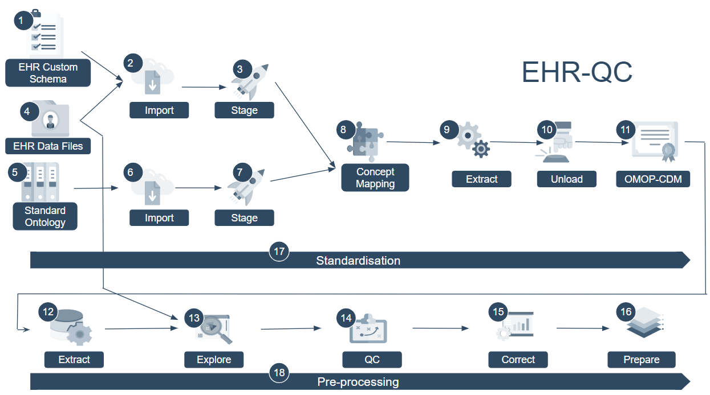

EHRQC
=====

EHR-QC is a complete end-to-end pipeline to standardise and preprocess Electronic Health Records (EHR) for downstream integrative machine learning applications. This utility has two distinct modules;

1. Standardisation
2. Pre-processing

Both the modules can be run as a single end-to-end pipeline or individual components can be run in a standalone manner.

This utility is primarily focussed to provide a domain specific toolset for performing commmon standardisation and pre-processing tasks while handling the healthcare data. A command line interface is designed to provide an abstraction over the internal implementation details while at the same time being easy to use for anyone with basic Linux skills.

.. topic:: Acknowledgements

   .. image:: source/images/monash.png
      :width: 20 %

   .. image:: source/images/alfred.png
      :width: 20 %

   .. image:: source/images/superbugai.png
      :width: 20 %

Cite Us
-------

If you use this library for your research, please cite our paper:

Yashpal Ramakrishnaiah, Nenad Macesic, Geoffrey I. Webb, Anton Y. Peleg, Sonika Tyagi,

*EHR-QC: A streamlined pipeline for automated electronic health records standardisation and preprocessing to predict clinical outcomes,
Journal of Biomedical Informatics*,

Volume 147, 2023, 104509, ISSN 1532-0464,

https://doi.org/10.1016/j.jbi.2023.104509.

(https://www.sciencedirect.com/science/article/pii/S1532046423002307)

BibTeX:

.. code-block:: latex

   @article{RAMAKRISHNAIAH2023104509,
   title = {EHR-QC: A streamlined pipeline for automated electronic health records standardisation and preprocessing to predict clinical outcomes},
   journal = {Journal of Biomedical Informatics},
   volume = {147},
   pages = {104509},
   year = {2023},
   issn = {1532-0464},
   doi = {https://doi.org/10.1016/j.jbi.2023.104509},
   url = {https://www.sciencedirect.com/science/article/pii/S1532046423002307},
   author = {Yashpal Ramakrishnaiah and Nenad Macesic and Geoffrey I. Webb and Anton Y. Peleg and Sonika Tyagi},
   keywords = {Digital health, Electronic health records, EHR, Clinical outcome prediction, Machine learning},
   abstract = {The adoption of electronic health records (EHRs) has created opportunities to analyse historical data for predicting clinical outcomes and improving patient care. However, non-standardised data representations and anomalies pose major challenges to the use of EHRs in digital health research. To address these challenges, we have developed EHR-QC, a tool comprising two modules: the data standardisation module and the preprocessing module. The data standardisation module migrates source EHR data to a standard format using advanced concept mapping techniques, surpassing expert curation in benchmarking analysis. The preprocessing module includes several functions designed specifically to handle healthcare data subtleties. We provide automated detection of data anomalies and solutions to handle those anomalies. We believe that the development and adoption of tools like EHR-QC is critical for advancing digital health. Our ultimate goal is to accelerate clinical research by enabling rapid experimentation with data-driven observational research to generate robust, generalisable biomedical knowledge.}
   }

Contents
--------

.. toctree::

   install_ehrqc
   install_ehrqc_preprocess
   install_ehrqc_standardise
   config
   migrate
   process
   use_cases
   case_study
