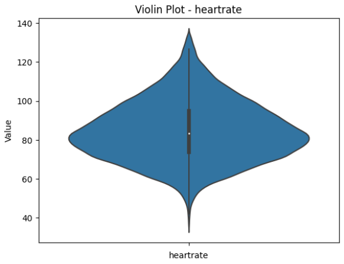
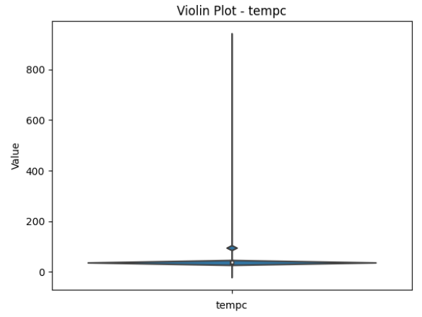
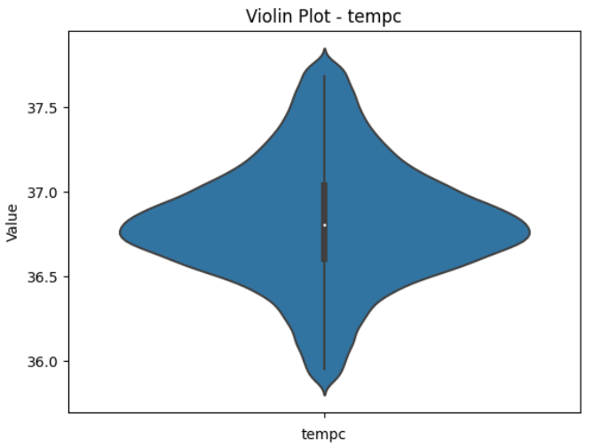

Anomalies
=========

1. Missing Data
---------------

The missing data plot generated from EHR-QC is intended to visualise the missingness in the data supplied. A single bar is generated for each of the attribute in the data supplied with gaps in the bars indicating the missing rows for that attribute. So, by looking at the generated bar code plot, the user will be able to deduce;

1. The presence of missingness in the data
2. The extent of missingness in the data
3. Patterns of the missingness in the data (random, systematic, blocks etc...)

Use Case
++++++++

In this use case, firstly, the ``vitals`` values are extracted from the EHR.

.. code-block:: console

    (.venv) user@hostname:~/workspace/EHRQC$.venv/bin/python -m ehrqc.extract.Extract temp/omop_vitals.csv omop vitals omop_cdm

Next, a missing data plot is generated using EHR-QC exploration graphs utility on the extracted data.

.. code-block:: console

    (.venv) user@hostname:~/workspace/EHRQC$.venv/bin/python -m ehrqc.qc.Plot vitals_explore temp/omop_vitals.csv temp/omop_vitals_explore.html

Later, missing data imputation is performed using EHR-QC imputation utlity on the extracted data.

.. code-block:: console

    (.venv) user@hostname:~/workspace/EHRQC$.venv/bin/python -m ehrqc.qc.Impute impute temp/omop_vitals.csv -sp=temp/omop_vitals_imputed.csv -a=mean

Finally, the missing data plot is drawn again on the imputed data and compared with the earlier plot.

.. code-block:: console

    (.venv) user@hostname:~/workspace/EHRQC$.venv/bin/python -m ehrqc.qc.Plot vitals_explore temp/omop_vitals_imputed.csv temp/omop_vitals_imputed_explore.html

**Output:**

Here, Figure 1A shows the bar code plot with missing values which can be identified by looking at the gaps in the bars for corresponding attributes while Figure 1B shows the same plot with no gaps after handling the missingness in the data.

Figure 1A: Missing data plot with missing values

.. image:: images/plots/missing_plot_1.png

Figure 1B: Missing data plot without missing values

.. image:: images/plots/missing_plot_2.png

2. Exploration
--------------

The exploration plots generated from EHR-QC are intended to visualise the distribution of the data supplied. The generated plots depend on the type of attribute.

Continuous Attributes
~~~~~~~~~~~~~~~~~~~~~

Use Case 1
++++++++++

If an attribute is continuous in nature, violin plots showing the density distribution of values are generated. With that, the uses should be able to identify;

1. The spread of the values
2. The upper and lower extremes of the data
3. The presence of multiple modalities
4. The presence of erroneous values

In the first use case, the ``vitals`` values are extracted from the EHR.

.. code-block:: console

    (.venv) user@hostname:~/workspace/EHRQC$.venv/bin/python -m ehrqc.extract.Extract temp/omop_vitals.csv omop vitals omop_cdm

Next, a distribution plot is generated using EHR-QC exploration graphs utility on the extracted data.

.. code-block:: console

    (.venv) user@hostname:~/workspace/EHRQC$.venv/bin/python -m ehrqc.qc.Plot vitals_explore temp/omop_vitals.csv temp/omop_vitals_explore.html

Later, extreme values are removed using EHR-QC correction utlity from the extracted data.

.. code-block:: console

    (.venv) user@hostname:~/workspace/EHRQC$.venv/bin/python -m ehrqc.qc.Correct correct temp/omop_vitals.csv -sp=temp/omop_vitals_corrected.csv

Finally, the distribution data plot is drawn again on the corrected data and compared with the earlier plot.

.. code-block:: console

    (.venv) user@hostname:~/workspace/EHRQC$.venv/bin/python -m ehrqc.qc.Plot vitals_explore temp/omop_vitals.csv temp/omop_vitals_explore.html

**Output:**

Here, Figure 2A shows the violing plot with extreme values which can be identified by looking at the scale of the central axis corresponding to impossible values of up to 800 for ``heart rate`` attribute while Figure 2B shows the same plot with normal ranges.

Figure 2A: Exploration plot for ``Heart Rate`` with extreme values

.. image:: images/plots/exploration_plot_1.png

Figure 2B: Exploration plot for ``Heart Rate`` with normal values

Use Case 2
++++++++++

In the second use case, the ``vitals`` values are extracted from the EHR.

.. code-block:: console

    (.venv) user@hostname:~/workspace/EHRQC$.venv/bin/python -m ehrqc.extract.Extract temp/omop_vitals.csv omop vitals omop_cdm

Next, a distribution plot is generated using EHR-QC exploration graphs utility on the extracted data.

.. code-block:: console

    (.venv) user@hostname:~/workspace/EHRQC$.venv/bin/python -m ehrqc.qc.Plot vitals_explore temp/omop_vitals.csv temp/omop_vitals_explore.html

Later, non-standard values are removed using custom code from the extracted data.

Finally, the distribution data plot is drawn again on the corrected data and compared with the earlier plot.

.. code-block:: console

    (.venv) user@hostname:~/workspace/EHRQC$.venv/bin/python -m ehrqc.qc.Plot vitals_explore temp/omop_vitals.csv temp/omop_vitals_explore.html

**Output:**

Here, Figure 2c shows the violin plot with multi-modal distribution indicating the possible presence of non-uniform scale for values while Figure 2D shows the same plot with uniform data after correction.

Figure 2C: Exploration plot with multiple modalities

Figure 2D: Exploration plot with corrected data

Discrete Attributes
~~~~~~~~~~~~~~~~~~~~~

If an attribute is descrete in nature, bar plots showing the frequency counts are generated. With that, the uses should be able to identify;

1. The category wise distribution of values
2. The presence of erroneous/unwanted values
3. Other errors related to non-standardisation or non-uniformity of the data

Use Case
++++++++

In this use case, the ``demographics`` values are extracted from the EHR.

.. code-block:: console

    (.venv) user@hostname:~/workspace/EHRQC$.venv/bin/python -m ehrqc.extract.Extract temp/omop_demographics.csv omop demographics omop_cdm

Next, a distribution plot is generated using EHR-QC exploration graphs utility on the extracted data.

.. code-block:: console

    (.venv) user@hostname:~/workspace/EHRQC$.venv/bin/python -m ehrqc.qc.Plot demographics_explore temp/omop_demographics.csv temp/omop_demographics_explore.html

Later, non-standard values are handled using custom code from the extracted data. In this case two distinct categories i.e. ``UNKNOWN`` and ``UNABLE TO OBTAIN`` are combined together in to a single category for the purpose of demonstration.

Finally, the distribution data plot is drawn again on the corrected data and compared with the earlier plot.

.. code-block:: console

    (.venv) user@hostname:~/workspace/EHRQC$.venv/bin/python -m ehrqc.qc.Plot demographics_explore temp/omop_demographics.csv temp/omop_demographics_explore.html

**Output:**

Here, Figure 2c shows the violin plot with multi-modal distribution indicating the possible presence of non-uniform scale for values while Figure 2D shows the same plot with uniform data after correction.

Figure 3A: Exploration plot with non-standard descrete values

Figure 3B: Exploration plot with corrected descrete values

3. Outliers
-----------

The outlier plots generated from EHR-QC are intended to visualise relationship between attributes taking two at a time along with their outlier score providing an estimation of the presence of outliers in the data supplied. With this plot, the users should be able to;

1. Visualise the presence of outliers
2. Estimate the effectiveness of outlier removal technique

Use Case
++++++++

In this use case, the ``vitals`` values are extracted from the EHR.

.. code-block:: console

    (.venv) user@hostname:~/workspace/EHRQC$.venv/bin/python -m ehrqc.extract.Extract temp/omop_vitals.csv omop vitals omop_cdm

Next, an outlier plot is generated using EHR-QC outlier graphs utility on the extracted data.

.. code-block:: console

    (.venv) user@hostname:~/workspace/EHRQC$.venv/bin/python -m ehrqc.qc.Plot vitals_outliers temp/mimic_vitals_imputed.csv temp/mimic_vitals_outliers.html

Later, outliers are removed using EHR-QC correction utlity from the extracted data.

.. code-block:: console

    (.venv) user@hostname:~/workspace/EHRQC$.venv/bin/python -m ehrqc.qc.Correct correct temp/omop_vitals.csv -sp=temp/omop_vitals_corrected.csv

Finally, the outlier plot is drawn again on the corrected data and compared with the earlier plot.

.. code-block:: console

    (.venv) user@hostname:~/workspace/EHRQC$.venv/bin/python -m ehrqc.qc.Plot vitals_outliers temp/mimic_vitals_imputed.csv temp/mimic_vitals_outliers.html

**Output:**

Here, Figure 4A shows the outliers plot ``sysbp`` and ``heartrate`` attributes with the presence of outliers identified by the presence of high ensemble scores indicated by the color of the data points on the graph. In the next figure (Figure 4B), the same plot is drawn with the outliers removed by using conventional univariate outlier removal technique. Finally in Figure 4C, the outlier graph is drawn on the data obtained after removing outliers using EHR-QC utility functions.

Figure 4A: Outlier plot with outliers in the data

Figure 4B: Outlier plot by removing outliers identified using traditional techniques

Figure 4C: Outlier plot by removing outliers identified using EHR-QC

