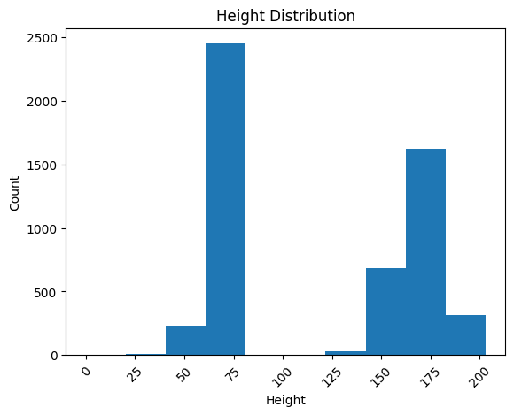
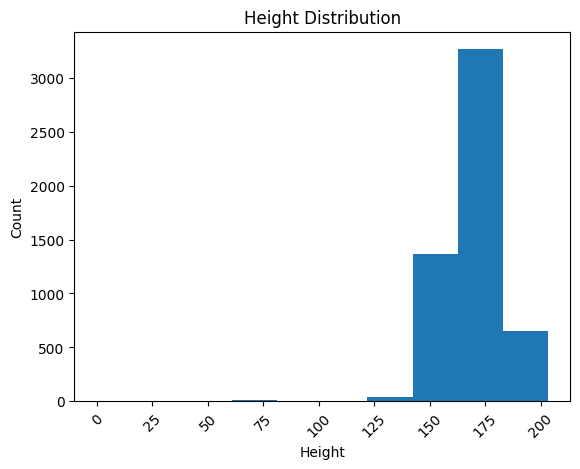

##########
Case Study
##########

Extraction and preparation of Sepsis data for Machine Learning applications.

*******
Outline
*******

#. Introduction
#. Set-up
#. Cohort Selection
#. Data Standardisation
#. Data Preperation
#. Data Pre-processing
#. Data Preparation
#. Conclusion

1. Introduction
===============

In this case study, our main objective is to showcase the effectiveness of EHR-QC. We achieve this by employing the toolkit to handle EHR data comprehensively, preparing it for utilization in Machine Learning applications. To illustrate, we select a group of patients who have been diagnosed with Sepsis from the public MIMIC IV EHR database. Subsequently, we employ the EHR-QC standardization module to standardise the EHR records for these patients, converting them into the OMOP-CDM schema. Following this, we employ the EHR-QC data pre-processing module. This involves extracting information from the standardized schema, generating exploratory reports, and identifying as well as rectifying any anomalies present in the data.

2. Set-up
=========

In this case study, we utilizeed the Dockerized EHR-QC. For comprehensive instructions on configuring the Docker environment, please consult the documentation provided at the following link: https://ehr-qc-tutorials.readthedocs.io/en/latest/install.html#docker

3. Cohort selection
===================

From the MIMIC IV dataset, we've identified all patients and admissions related to Sepsis. This selection involves utilizing ICD-9 codes 995.91, 995.92, and 785.52, as well as ICD-10 codes A419, R6520, and R6521, which pertain to Sepsis, Severe Sepsis, and Septic Shock. Subsequently, we've extracted the complete electronic health record (EHR) data associated with these patients and admissions, converting them into csv files.

This process yielded a total of 12,276 patients corresponding to 14,870 admissions, along with their respective EHR data.

4. Data standardisation
=======================

In the subsequent phase, the EHR data associated with the Sepsis cohort, as contained in the CSV files, is standardized by being structured according to the OMOP-CDM schema. This task is accomplished through the utilization of the EHR-QC utility, which carries out a series of sequential steps, culminating standard EHR representation. The procedure involves the following stages:

#. Incorporating the Standard Vocabulary (Athena)
#. Importing EHR data from the CSV files
#. Staging the data within staging tables
#. Integrating custom concept mappings for concepts that deviate from the standard
#. Executing the migration process
#. Transitioning to the OMOP-CDM schema

For more comprehensive insights into each of these stages, please consult the following link: https://ehr-qc-tutorials.readthedocs.io/en/latest/migrate.html#omop-cdm-migration.

This culminated in the successful migration of the entire cohort (100 %), encompassing all the 12,276 patients and 14,870 admissions, alongside their respective EHR data in a fully automated manner.

Utilizing well-established, compatible tools and techniques becomes notably more straightforward when working with data that has been transformed into a standardized format.

5. Data Extraction
==================

During this stage, we retrieve the demographics, vital signs, and lab measurements of the Sepsis cohort from the standardized OMOP-CDM schema using EHR-QC pre-processing module.

Successful extraction yield the following data:

#. Demographics data for 12,276 patients, encompassing 7 attributes: ``Age``, ``Weight``, ``Height``, ``Gender``, ``Ethnicity``, ``Date of Birth``, and ``Date of Death`` (if applicable)
#. Vital signs data for 8,436 patients, comprising 10 attributes: ``Heart rate``, ``Systolic Blood Pressure``, ``Diastolic Blood Pressure``, ``Mean Blood Pressure``, ``Respiratory rate``, ``Body Temperature``, ``Oxygen Saturation (SpO2)``, ``Glasgow Coma Scale (GCS) Eye score``, ``GCS Verbal score``, and ``GCS Motor score``
#. Lab measurements for 12,169 patients, involving 29 attributes: ``Lactate``, ``Blood Carbon Dioxide``, ``Albumin``, ``Urine Glucose``, ``Band Form Neutrophils``, ``Blood Base Excess``, ``Blood Potassium``, ``Blood pH``, ``Serum Chloride``, ``Serum Carbon Dioxide``, ``Bilirubin``, ``Blood Auto Leukocytes``, ``Creatinine``, ``INR (International Normalized Ratio)``, ``Serum Sodium``, ``Blood Sodium``, ``Hemoglobin``, ``Body Fluid pH``, ``Platelet Count``, ``Urea Nitrogen``, ``Serum Glucose``, ``Blood Chloride``, ``Oxygen``, ``Bicarbonate``, ``Serum Potassium``, ``Anion Gap``, ``Manual Blood Leukocytes``, ``Hematocrit``, and ``aPTT (Activated Partial Thromboplastin Time)``

It's worth noting that some patients lack recorded values for the listed vital signs or lab measurements attributes. Consequently, these patients are excluded from the extracted files, resulting in a reduction in the total number of rows after this stage. Specifically, our efforts yield complete demographic data for the entire Sepsis cohort of 12,276 patients, while lab measurements are available for 12,169 patients, and vital signs data is present for approximately 8,436 patients only.

To understand the extraction capabilities offered by the EHR-QC, kindly consult the documentation provided at: https://ehr-qc-tutorials.readthedocs.io/en/latest/process.html#extract

6. Data Pre-processing
======================

Next, the exploration and anomaly reports are generated from the extracted data using EHR-QC pre-processing module. It will also highlight the presence of anomalous data, and provide specific pointers to correct them. Furthermore, it has the capability to automatically impute the missing values and remove the outliers. In this section we illustrate a few use cases demonstrating the functionality of the module; 

Units Mixup
-----------

The analysis of demographic data reveled a multimodal distribution within the "Height" attribute. The generated plot in the demographic data exploration report clearly illustrates the overlap of two distributions. A closer examination of the value ranges within these distributions hints at the potential mix-up of two distinct units of measurement: inches and feet.

To preempt any downstream errors stemming from this mixed measurement scenario, we have rectified the situation to establish uniformity. Following these adjustments, a renewed exploration report was generated, showcasing the successful normalization of the "Height" attribute to a consistent unit of measurement.

7. Data Preparation
===================

Data standardisation and normalisation

8. Conclusion
=============

Discuss the final counts available for performing Machine Learning applications.
