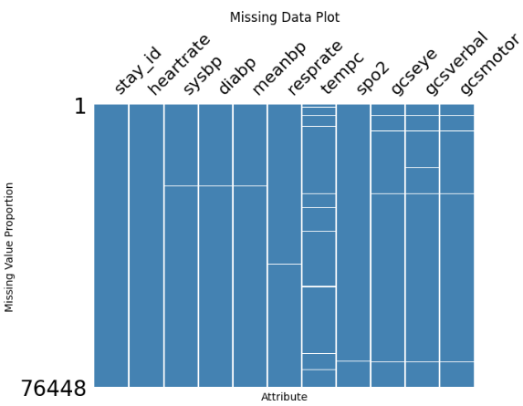
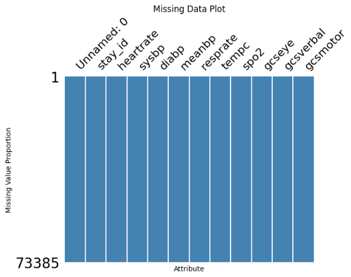
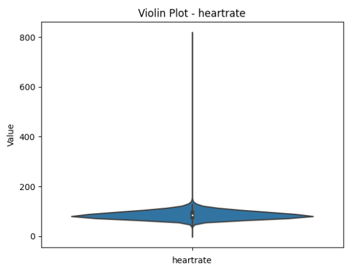
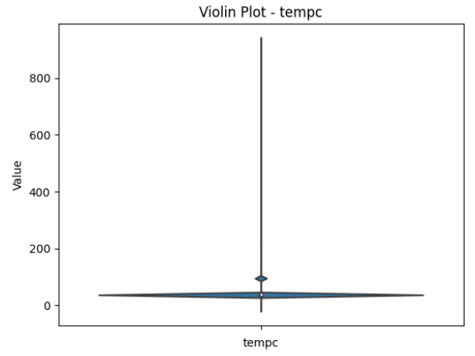
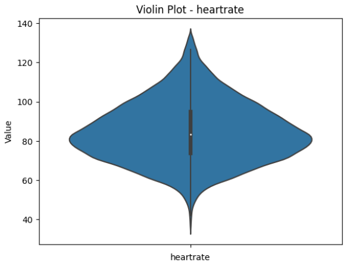

Plots
=====

Missing Data Plots
------------------

The missing data plot generated from EHR-QC is intended to visualise the missingness in the data supplied. A single bar is generated for each of the attribute in the data supplied with gaps in the bars indicating the missing rows for that attribute. So, by looking at the gaps, the user will be able to deduce;

1. The presence of missingness in the data
2. The extent of missingness in the data
3. Patterns of the missingness in the data (random, systematic, blocks etc...)

Example 1: Missing data plot with missing values

Example 2: Missing data plot without missing values

Exploration Plots
-----------------

The exploration plots generated from EHR-QC are intended to visualise the distribution of the data supplied. The generated plots depend on the type of attribute.

* Continuous Attributes
~~~~~~~~~~~~~~~~~~~~~~~

If an attribute is continuous in nature, violin plots showing the density distribution of values are generated. With that, the uses should be able to identify;

1. The spread of the values
2. The upper and lower extremes of the data
3. The presence of multiple modalities
4. The presence of erroneous values

Example 1: Exploration plot with extreme values

Example 2: Exploration plot with multiple modalities

Example 3: Exploration plot with good data

* Discrete Attributes
~~~~~~~~~~~~~~~~~~~~~

Outlier Plots
-------------

